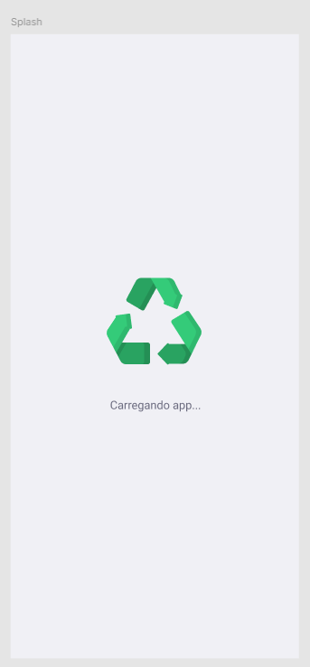
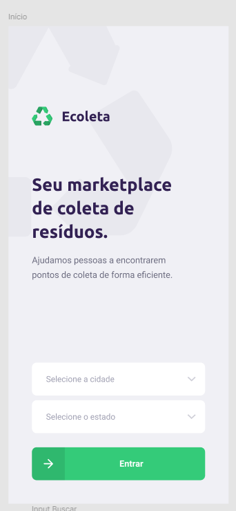
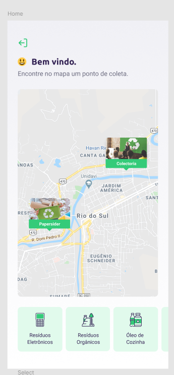
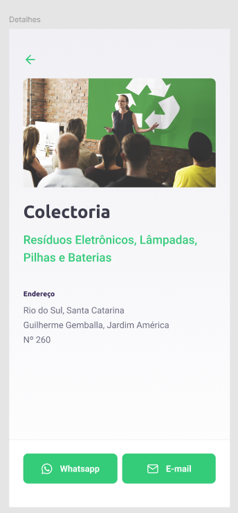

# Front-end Móvel

O projeto EcoPonto tem como objetivo criar uma plataforma móvel que ajude os usuários a encontrar pontos de coleta de resíduos recicláveis, como pilhas, baterias, eletrônicos, entre outros. O usuário pode escolher a cidade e o estado, visualizar um mapa com os pontos de coleta e filtrar por tipo de resíduo. Ao clicar em um ponto de coleta, o usuário pode visualizar mais detalhes, incluindo o endereço e a opção de entrar em contato via WhatsApp ou e-mail.

## Tecnologias Utilizadas

- **React Native**: Framework para desenvolver aplicativos móveis nativos para iOS e Android.
- **Expo**: Ferramenta para facilitar o desenvolvimento, build e deploy de aplicativos React Native.
- **React Navigation**: Biblioteca para navegação entre telas dentro do aplicativo.
- **Axios**: Utilizado para fazer requisições HTTP ao backend para carregar dados dos pontos de coleta.
- **React Native Maps**: Para exibir pontos de coleta em um mapa interativo.
- **Expo Location**: Para capturar a localização do usuário e ajustar os pontos de coleta com base na posição geográfica.
- **React Native Gesture Handler**: Para gerenciar gestos de interação com a interface, como deslizar ou clicar.
- **React Native Reanimated**: Para criar animações fluidas e interações visuais no aplicativo.
- **React Native Safe Area Context**: Para garantir que o conteúdo da aplicação não fique oculto em áreas seguras da tela, especialmente em dispositivos com "notch".
- **React Native Screens**: Para otimizar a navegação entre as telas, melhorando a performance.
- **React Native SVG**: Utilizado para gráficos vetoriais escaláveis, como ícones e outros elementos gráficos.
- **Expo Font**: Para carregar e utilizar fontes personalizadas, como Roboto e Ubuntu.

## Arquitetura

O aplicativo móvel é composto por três telas principais:

- **Tela de Loading**: Apresenta o logo da EcoPonto e uma breve mensagem de carregamento.
- **Tela de Início**: Onde o usuário escolhe a cidade e o estado para filtrar os pontos de coleta.
- **Tela de Mapa**: Exibe um mapa com pontos de coleta, podendo filtrar por tipo de resíduo. Ao clicar em um ponto de coleta, o usuário pode ver mais detalhes.
- **Tela de Detalhes**: Exibe os detalhes sobre o ponto de coleta e tem a opção de entrar em contato via WhatsApp ou email.

Essas telas estão interconectadas através da navegação do React Navigation. O fluxo de dados é baseado em requisições HTTP para buscar os pontos de coleta e filtrar os dados.

## Modelagem da Aplicação

A modelagem da aplicação é composta por quatro tabelas principais:

1. **points**: Armazena informações sobre os pontos de coleta.

   - Campos: `id`, `image`, `name`, `email`, `whatsapp`, `latitude`, `longitude`, `city`, `uf`.

2. **items**: Armazena informações sobre os tipos de materiais aceitos.

   - Campos: `id`, `image`, `title`.

3. **point_items**: Tabela de relacionamento que vincula os pontos de coleta aos itens aceitos.

   - Campos: `id`, `point_id`, `item_id`.

4. **users**: Gerencia os dados dos usuários cadastrados na plataforma.
   - Campos: `id`, `name`, `email`, `password`, `created_at`, `updated_at`.

### Diagrama

## Projeto da Interface

### Wireframes

 
 

### Design Visual

- **Paleta de Cores**: O design segue uma paleta de cores verde, que remete à sustentabilidade e reciclagem. A tonalidade de verde predominante é clara, com detalhes em tons mais escuros para contraste.
- **Tipografia**: Utilização das fontes Roboto e Ubuntu para garantir legibilidade e uma aparência moderna.
- **Ícones**: Ícones simples e intuitivos, como o ícone de localização para pontos de coleta e ícones de WhatsApp e Email para as opções de contato.

### Layout Responsivo

O layout é adaptável a diferentes tamanhos de tela, utilizando componentes flexíveis que ajustam o conteúdo de acordo com a resolução do dispositivo. Em dispositivos menores, os elementos são reorganizados para garantir uma boa experiência de navegação.

### Interações do Usuário

- **Animações**: O usuário terá animações suaves ao navegar entre as telas e ao interagir com os pontos no mapa.
- **Transições**: Ao clicar em um ponto de coleta, o aplicativo realiza uma transição animada para a tela de detalhes.

## Fluxo de Dados

1 - **Seleção de Cidade e Estado**: O usuário escolhe a cidade e o estado, que são enviados para o backend via API.
2 - **Exibição do Mapa**: O aplicativo recebe a lista de pontos de coleta filtrados pela localização escolhida e exibe no mapa.
3 - **Exibição dos Detalhes**: Ao clicar em um ponto de coleta, o aplicativo mostra detalhes como o nome, endereço, e opções de contato.

## Requisitos Funcionais

1 - **Tela de Seleção**: O usuário deve poder escolher cidade e estado.
2 - **Exibição do Mapa**: O mapa deve ser exibido com pontos de coleta filtrados pela localização.
3 - **Filtros de Itens de Coleta**: O usuário deve poder filtrar pontos de coleta por tipo de resíduo.
4 - **Tela de Detalhes**: Ao clicar em um ponto, o usuário deve ver o endereço e ter a opção de enviar mensagem via WhatsApp ou email.

## Requisitos Não Funcionais

1 - **Desempenho**: O aplicativo deve ser rápido ao carregar os dados do mapa e ao aplicar filtros.
2 - **Escalabilidade**: O sistema deve ser capaz de adicionar mais pontos de coleta sem comprometer o desempenho.
3 - **Segurança**: O aplicativo deve proteger as informações dos usuários, especialmente ao usar serviços de terceiros para WhatsApp e email.

## Considerações de Segurança

1 - **Autenticação**: Embora a aplicação móvel não tenha um sistema de login, todos os dados que são transmitidos para o backend devem ser feitos via HTTPS para garantir a segurança.
2 - **Autorização**: A comunicação com os serviços de WhatsApp e email deve ser feita de forma segura, usando APIs autenticadas.

## Implantação

1 - **Requisitos**:
  - Dispositivos móveis com Android ou iOS.
  - Ambiente de desenvolvimento configurado com Expo e React Native.

2 - **Configuração do Ambiente**:
  - Instale as dependências do projeto utilizando npm install ou yarn install.

3 - **Deploy**:
  - Para iOS e Android, o aplicativo pode ser distribuído via Expo para testes e produção.
  - Utilize os comandos expo start, expo build:android ou expo build:ios para gerar os builds finais.

## Testes

### Cenários Testados:

1. **Adicionar dados de Cidade e UF**:
   - **Teste**: Inserir localização para visualizar o mapa.
   - **Validação**: Na tela inicial, deve ser possível adicionar cidade e UF e clicar no botão para ser direcionado ao mapa daquela localização.
   

2. **Visualizar pontos de coleta**:
   - **Teste**: Visualizar o mapa com pontos de coleta e realizar filtragem por itens.
   - **Validação**: Deve ser possível visualizar o mapa com pontos de coleta e realizar filtragem clicando nos itens abaixo.
   

3. **Visualizar detalhes do ponto de coleta**:
   - **Teste**: Visualizar detalhes do ponto e entrar em contato.
   - **Validação**: Deve ser possível o usuário visualizar todos os detalhes do ponto de coleta. Além disso, ao clicar nos botões "WhatsApp" ou "E-mail" deve ser redirecionado para os respectivos apps já com as informações de contato do ponto.
   

# Referências

- **Expo**: Framework para desenvolvimento de aplicações móveis com React Native. Documentação oficial: https://docs.expo.dev
- **React Native**: Framework para construir aplicativos móveis nativos utilizando JavaScript e React. Documentação oficial: https://reactnative.dev
- **React Navigation**: Biblioteca para navegação entre telas no React Native. Documentação oficial: https://reactnavigation.org
- **Axios**: Cliente HTTP para realizar requisições de forma simplificada. Documentação oficial: https://axios-http.com
- **React Native Maps**: Biblioteca para integrar mapas interativos no React Native. Documentação oficial: https://github.com/react-native-maps/react-native-maps
- **Expo Location**: Biblioteca do Expo para acessar a localização geográfica do dispositivo. Documentação oficial: https://docs.expo.dev/versions/latest/sdk/location
- **React Native Gesture Handler**: Biblioteca para lidar com gestos no React Native. Documentação oficial: https://docs.swmansion.com/react-native-gesture-handler
- **React Native Reanimated**: Biblioteca para animações avançadas no React Native. Documentação oficial: https://docs.swmansion.com/react-native-reanimated
- **React Native Safe Area Context**: Biblioteca para garantir que o conteúdo da aplicação não sobreponha áreas seguras da tela. Documentação oficial: https://github.com/th3rdwave/react-native-safe-area-context
- **React Native Screens**: Biblioteca para otimização da navegação entre telas, melhorando a performance. Documentação oficial: https://github.com/software-mansion/react-native-screens
- **React Native SVG**: Biblioteca para renderizar gráficos vetoriais no React Native. Documentação oficial: https://github.com/react-native-svg/react-native-svg
- **Expo Font**: Biblioteca do Expo para carregar fontes customizadas no React Native. Documentação oficial: https://docs.expo.dev/versions/latest/sdk/font
