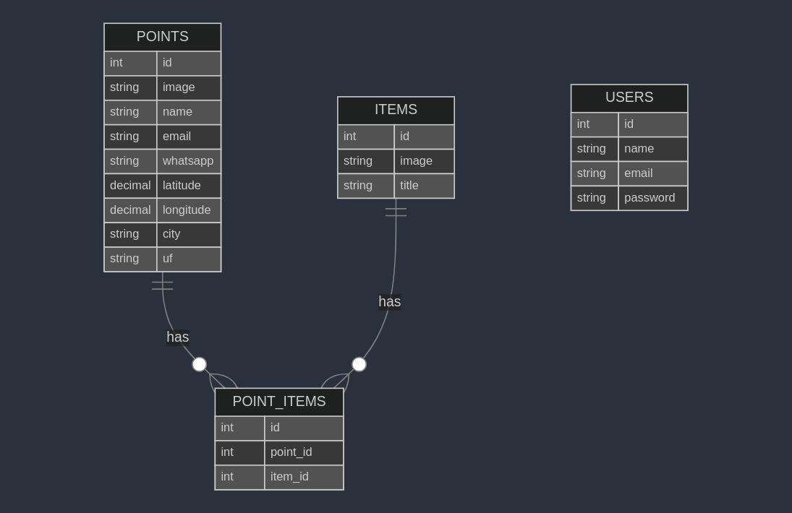
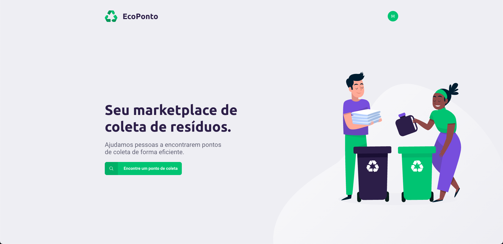
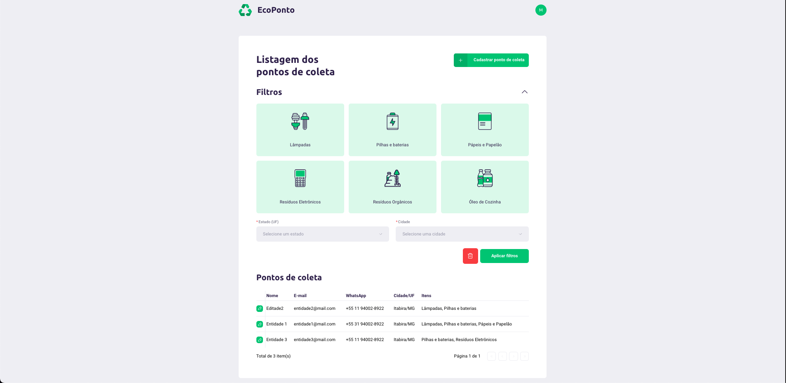
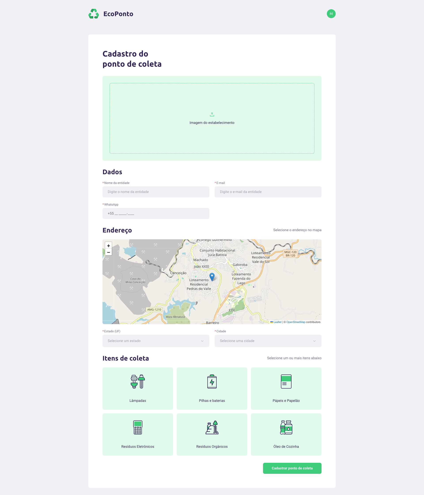
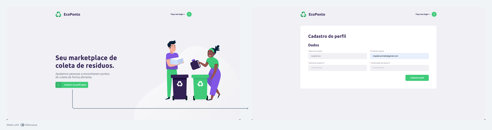
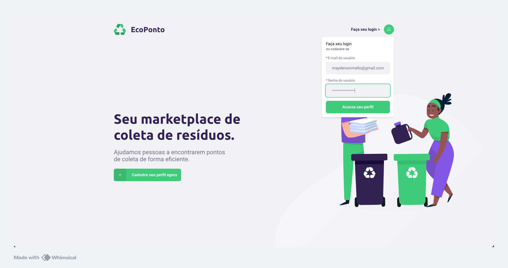
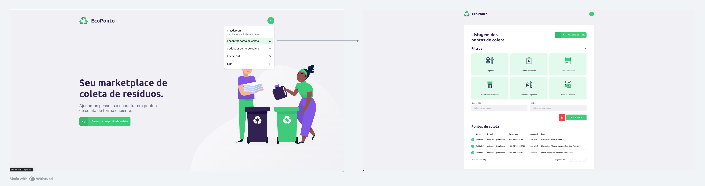
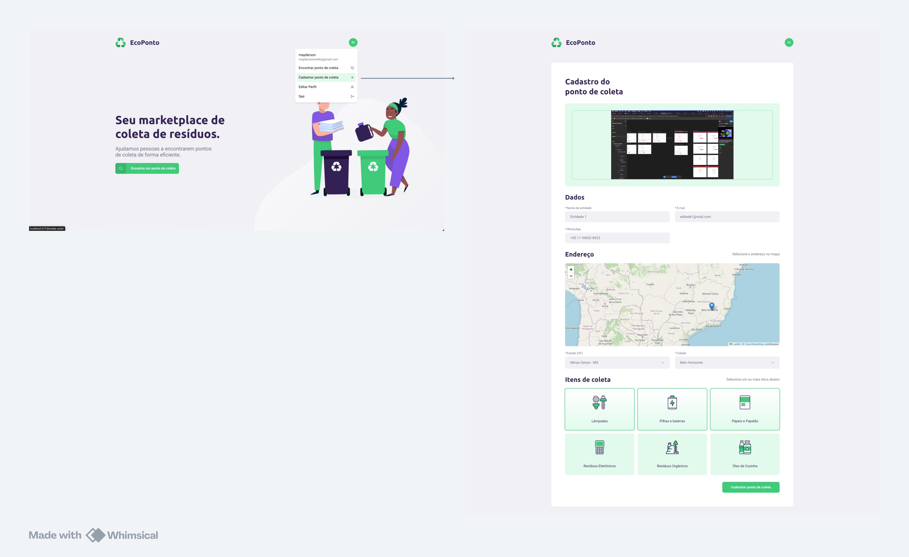
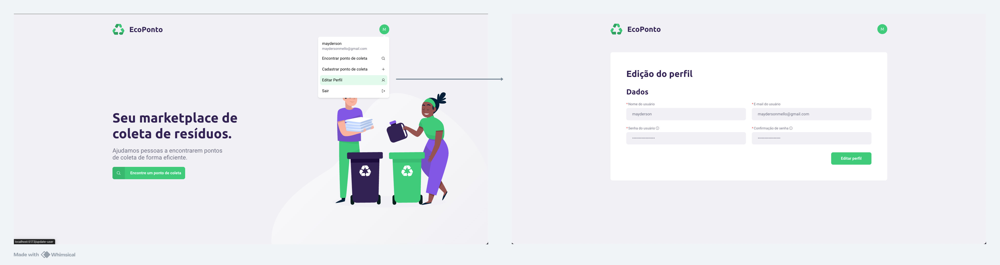

# Front-end Web

## Tecnologias Utilizadas

- **React JS**: Biblioteca para criação de interfaces de usuário.
- **TypeScript**: Superconjunto do JavaScript com tipagem estática.
- **@hookform/resolvers**: Integração de validadores de schema com React Hook Form.
- **@phosphor-icons/react**: Biblioteca de ícones personalizáveis para React.
- **@radix-ui/react-dropdown-menu**: Componente de menu suspenso acessível e estilizado para React.
- **@radix-ui/react-select**: Componente de seletor customizável e acessível para React.
- **@radix-ui/react-tooltip**: Tooltip personalizável e acessível para React.
- **@react-input/mask**: Biblioteca para máscaras de entrada de dados em campos React.
- **@tanstack/react-query**: Biblioteca para gerenciamento de dados assíncronos, incluindo cache e sincronização.
- **axios**: Cliente HTTP para fazer requisições assíncronas a APIs.
- **clsx**: Utilitário para condicionar a inclusão de classes CSS.
- **leaflet**: Biblioteca para mapas interativos e navegação geoespacial.
- **leaflet-defaulticon-compatibility**: Solução para compatibilidade de ícones padrão com Leaflet.
- **react**: Biblioteca JavaScript para criação de interfaces de usuário declarativas.
- **react-dom**: Pacote para manipulação de DOM em projetos React.
- **react-dropzone-esm**: Utilitário para adicionar recursos de upload arrastando e soltando arquivos.
- **react-helmet-async**: Manipula o head da página, como título e meta tags, com suporte para renderização assíncrona.
- **react-hook-form**: Biblioteca para criação e gerenciamento de formulários no React.
- **react-leaflet**: Integração do Leaflet com React para exibição de mapas.
- **react-router-dom**: Biblioteca para roteamento em aplicações React.
- **sonner**: Biblioteca para exibição de notificações personalizáveis.
- **tailwind-merge**: Utilitário para mesclar classes do Tailwind CSS.
- **zod**: Biblioteca para validação e definição de schemas de dados.

## Arquitetura da Aplicação Web

A arquitetura da aplicação é baseada em uma estrutura modular, com componentes independentes que facilitam o desenvolvimento, a manutenção e a escalabilidade do projeto. Abaixo estão os principais componentes e suas interações:

### 1. **Frontend (React com TypeScript)**

- **Componentização**: A aplicação utiliza React com TypeScript para organizar a interface em componentes reutilizáveis e tipados, promovendo consistência e segurança no código.
- **Gerenciamento de Estado**: Usa React Hook Form para manipulação de formulários e React Query para gerenciamento de dados assíncronos, mantendo o estado do cliente sincronizado com o servidor.
- **Roteamento**: O React Router Dom gerencia a navegação e a estrutura de páginas.
- **Estilos**: Utiliza Tailwind CSS para estilização rápida e o utilitário `tailwind-merge` para lidar com a combinação de classes dinâmicas.

### 2. **Camada de Notificações e Feedback**

- **Notificações**: Usa a biblioteca Sonner para exibir notificações de forma visual e não intrusiva ao usuário.
- **Tooltip e Acessibilidade**: Usa Radix UI para oferecer componentes acessíveis, como tooltips e menus suspensos, garantindo uma experiência consistente.

### 3. **Mapas e Geolocalização**

- **Integração com Leaflet**: Usa Leaflet e React Leaflet para mapas interativos. A biblioteca leaflet-defaulticon-compatibility é utilizada para tratar a compatibilidade de ícones.

### 4. **Camada de Segurança**

- **Tratamento de Entrada de Dados**: Aplicação de máscaras com a biblioteca @react-input/mask para entrada de dados segura.
- **Validação e Sanitização**: Zod é utilizado para validar e sanitizar dados antes de serem enviados ao backend.

### Fluxo de Dados e Interações

1. **Interação do Usuário**: Usuários interagem com a interface frontend, que é responsiva e acessível.
2. **Envio e Validação de Dados**: Dados enviados por formulários são validados no frontend com React Hook Form e Zod.
3. **Comunicação com o Servidor**: O frontend utiliza Axios para enviar dados para a API REST, que executa a lógica de negócio e armazena informações no banco de dados.
4. **Exibição de Dados e Atualizações**: Dados retornados pela API são armazenados no cache do React Query e exibidos ao usuário em tempo real.

Essa arquitetura modularizada permite que a aplicação escale com segurança, oferece alta manutenibilidade e melhora a experiência do usuário por meio de atualizações em tempo real e feedback visual.

## Modelagem da Aplicação

A modelagem da aplicação é composta por quatro tabelas principais:

1. **points**: Armazena informações sobre os pontos de coleta.

   - Campos: `id`, `image`, `name`, `email`, `whatsapp`, `latitude`, `longitude`, `city`, `uf`.

2. **items**: Armazena informações sobre os tipos de materiais aceitos.

   - Campos: `id`, `image`, `title`.

3. **point_items**: Tabela de relacionamento que vincula os pontos de coleta aos itens aceitos.

   - Campos: `id`, `point_id`, `item_id`.

4. **users**: Gerencia os dados dos usuários cadastrados na plataforma.
   - Campos: `id`, `name`, `email`, `password`, `created_at`, `updated_at`.

### Diagrama

## Projeto da Interface Web

## Projeto da Interface Web da Aplicação

A interface web da aplicação EcoPonto foi projetada com foco na usabilidade, utilizando um design minimalista e moderno que facilita a navegação e incentiva o uso da plataforma. Abaixo estão os detalhes do design visual, layout das páginas e interações do usuário.

### 1. **Design Visual**

- **Paleta de Cores**: A interface usa tons de verde e roxo, simbolizando sustentabilidade e inovação, transmitindo uma mensagem de cuidado com o meio ambiente.
- **Tipografia**: Utiliza a fonte Roboto, a tipografia é amigável e moderna, com um foco em legibilidade. Os títulos estão em destaque, utilizando uma fonte de maior peso, enquanto o texto auxiliar é mais sutil.
- **Ilustrações**: A página inicial apresenta ilustrações de pessoas interagindo com lixeiras de reciclagem, reforçando o tema de coleta de resíduos de forma amigável e educativa.
- **Botões e Ícones**: Ícones de reciclagem e botões com destaque em verde, são usados para guiar o usuário para as principais ações.

### 2. **Interações do Usuário**

- **Botão de Ações**: Ao clicar nos botões, o usuário é direcionado para a página solicitada ou é executada a ação solicitada.
- **Feedback Visual**: Elementos interativos, como botões, mudam de cor ao serem clicados ou quando o usuário passa o cursor sobre eles, oferecendo uma resposta visual que indica a interatividade.
- **Acessibilidade**: O design da interface segue boas práticas de acessibilidade, incluindo contraste de cores apropriado para leitura e suporte para navegação por teclado.

### 3. **Considerações sobre o Projeto da Interface**

A interface foi desenhada para ser intuitiva e acessível, promovendo uma experiência de usuário agradável. O uso de ilustrações e de uma paleta de cores que remete à sustentabilidade reforça o propósito da plataforma, incentivando o usuário a explorar e utilizar a aplicação para encontrar pontos de coleta de resíduos de maneira eficiente.

### Wireframes

### Layout Responsivo

A interface da EcoPonto é responsiva, adaptando-se a diferentes dispositivos para garantir uma experiência consistente:

- **Desktop-First**: Desenvolvida para telas grandes primeiro, ampliando para mobile.
- **Flexibilidade**: Layout ajustável com CSS Flexbox e Grid para reorganizar os elementos conforme o tamanho da tela.
- **Pontos de Interrupção**: Definidos para mobile e desktop, com ajustes específicos para otimizar legibilidade e usabilidade.
- **Interatividade**: Botões e elementos interativos redimensionados para facilitar o uso em dispositivos de toque.

Essas estratégias proporcionam uma navegação intuitiva e visualmente agradável em qualquer dispositivo.

## Fluxo de Dados

1. **Usuário (cidadão ou gestor)** interage com a **interface web** da aplicação, navegando por páginas e acessando funcionalidades como busca de pontos de coleta.
2. A aplicação web faz requisições à API, consumindo endpoints para obter dados de pontos de coleta, itens de descarte e autenticação de usuários.
3. Os dados retornados pela API são processados pela aplicação web e exibidos na interface, garantindo uma experiência interativa e em tempo real.
4. Em caso de erro, a aplicação exibe mensagens de feedback para o usuário, promovendo uma navegação orientada e amigável.

Esse fluxo assegura que a aplicação web funcione de forma dinâmica e conectada com o backend, proporcionando uma experiência de uso contínua e responsiva.

## Requisitos Funcionais

1. Cadastrar novos pontos de coleta com imagem, localização e materiais aceitos.
2. Atualizar informações de pontos de coleta existentes.
3. Listar e filtrar pontos de coleta por localização, tipo de material aceito, entre outros critérios.
4. Autenticação de usuários via JWT.
5. Upload de imagens associadas aos pontos de coleta.

## Requisitos Não Funcionais

1. **Desempenho:** A interface web deve ser responsiva e carregar os dados em menos de 500ms para garantir uma navegação fluida.
2. **Segurança:** Todas as interações sensíveis devem ser protegidas, seguindo práticas de segurança e conformidade com a LGPD.
3. **Escalabilidade:** A aplicação deve suportar um grande volume de usuários e requisições simultâneas sem comprometer o desempenho.
4. **Manutenibilidade:** O código front-end deve ser modular e seguir boas práticas de desenvolvimento, facilitando futuras atualizações e correções.

## Considerações de Segurança

Para garantir a segurança da aplicação distribuída EcoPonto, foram adotadas as seguintes medidas:

1. **Autenticação e Autorização:** Utilização de tokens JWT para autenticar e autorizar usuários, garantindo que apenas pessoas autorizadas acessem informações sensíveis.
2. **Proteção contra Ataques:** Implementação de práticas de segurança contra ataques comuns, como injeção de SQL, XSS e CSRF, assegurando a integridade dos dados e a proteção dos usuários.
3. **Criptografia de Dados:** Dados sensíveis são transmitidos de forma criptografada, utilizando HTTPS, para proteger as informações durante o tráfego na rede.
4. **Conformidade com a LGPD:** Coleta e armazenamento de dados de acordo com as diretrizes da LGPD, respeitando a privacidade dos usuários.

Essas considerações garantem uma navegação segura e protegem tanto os dados dos usuários quanto a integridade da aplicação.

## Implantação

# Implantação da Aplicação Web com Vite

## 1. Requisitos de Hardware e Software

- **Hardware:**

  - CPU: 2 núcleos
  - RAM: 4 GB
  - Armazenamento: SSD de 20 GB

- **Software:**
  - Sistema Operacional: Linux (Ubuntu 20.04 ou superior recomendado)
  - Node.js: Versão 20
  - NPM: Versão 7
  - Vite: 5.4.8

## 2. Plataforma de Hospedagem

- Netlify

## 3. Configuração do Ambiente de Implantação

- Ambiente será gerenciado pela própria Netlify.

## 4. Deploy da Aplicação

1. **Criar Conta:**

   - Acesse [Netlify](https://www.netlify.com/) e crie uma conta ou faça login.

2. **Novo Site:**

   - Clique em **"New site from Git"** no painel de controle.

3. **Conectar Repositório:**

   - Selecione o provedor de Git (GitHub, GitLab, Bitbucket).
   - Autentique e escolha o repositório da sua aplicação.

4. **Configurar Build:**

   - **Base directory:** Deixe em branco ou especifique um subdiretório, se necessário.
   - **Build command:** Insira `npm run build` (ou o comando equivalente).
   - **Publish directory:** Insira `dist` (ou o diretório onde os arquivos de produção são gerados).

5. **Configurar Variáveis de Ambiente (opcional):**

   - Vá para **"Site settings"** > **"Build & deploy"** > **"Environment"** para adicionar variáveis de ambiente.

6. **Deploy:**

   - Clique em **"Deploy site"**. O Netlify construirá e publicará sua aplicação.

7. **Visualizar Site:**
   - Após a conclusão do deploy, você receberá um link para acessar sua aplicação.

## Testes

### Cenários Testados:

1. **Criação de Conta**:

   - **Teste**: Deve ser possível criar uma conta com sucesso.
   - **Validação**: Na página inicial, deve clicar no botão "Cadastre seu perfil agora", preencher as informações necessárias e receber um feedback que a conta foi criada.

   

2. **Login**:

   - **Teste**: Deve ser possível fazer login no sistema.
   - **Validação**: Na página inicial, deve clicar no avatar do usuário, preencher as informações necessárias e clicar no botão "Acesse seu perfil".

   

3. **Listagem de Pontos**:

   - **Teste**: Deve ser possível listar os pontos de coleta cadastrados.
   - **Validação**: Após estar logado, deve clicar no avatar do usuário, e escolher a opção "Encontrar pontos de coleta", após isso deve ser exibido a lista de pontos de coleta cadastrados.

   

4. **Criação de Ponto**:

   - **Teste**: Deve ser possível criar um ponto de coleta com sucesso.
   - **Validação**: Após estar logado, deve clicar no avatar do usuário, e escolher a opção "Cadastrar ponto de coleta", preencher todos os campos necessários, e clicar no botão "Cadastrar ponto de coleta".

   

5. **Editar dados do Perfil**:

   - **Teste**: Deve ser possível editar as informações do perfil com sucesso.
   - **Validação**: Após estar logado, deve clicar no avatar do usuário, e ecolher a opção "Editar Perfil", preencher todas as informações necessárias e clicar no botão de "Editar Perfil".

   

# Referências

1. **Yarn**: Gerenciador de pacotes Node.js. Disponível em: [https://classic.yarnpkg.com](https://classic.yarnpkg.com)
2. **TypeScript**: Superset do JavaScript que adiciona tipagem estática ao código. Documentação oficial: [https://www.typescriptlang.org](https://www.typescriptlang.org)
3. **React**: Biblioteca JavaScript para criação de interfaces de usuário. Documentação oficial: [https://react.dev](https://react.dev)
4. **React Hook Form**: Biblioteca para gerenciar formulários no React de forma simples e eficiente. Documentação: [https://react-hook-form.com](https://react-hook-form.com)
5. **Zod**: Biblioteca de validação de esquemas de dados para JavaScript e TypeScript. Documentação: [https://zod.dev](https://zod.dev)
6. **Axios**: Cliente HTTP para realizar requisições de forma simplificada. Documentação: [https://axios-http.com](https://axios-http.com)
7. **Radix UI**: Conjunto de componentes acessíveis para React. Disponível em: [https://www.radix-ui.com](https://www.radix-ui.com)
8. **Leaflet**: Biblioteca JavaScript para criação de mapas interativos. Documentação oficial: [https://leafletjs.com](https://leafletjs.com)
9. **React Query**: Biblioteca para gerenciamento de estados de servidor em aplicações React. Documentação: [https://tanstack.com/query/latest](https://tanstack.com/query/latest)
10. **Tailwind CSS**: Framework CSS utilitário para construção rápida de interfaces personalizáveis. Documentação: [https://tailwindcss.com](https://tailwindcss.com)
